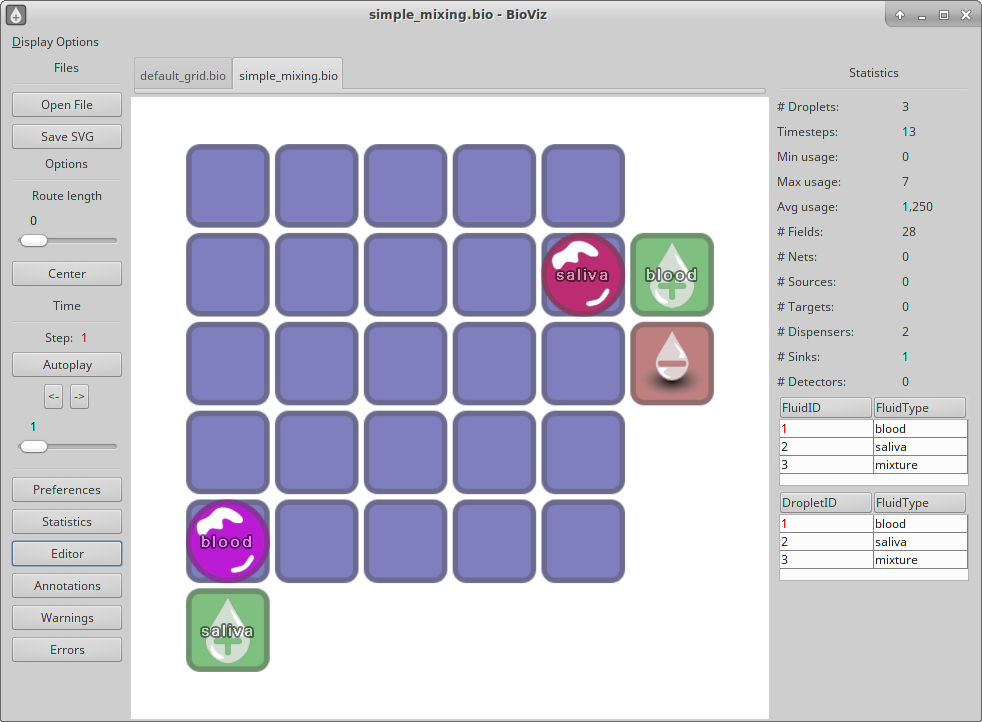

# BioViz #

*BioViz is an interactive software to visualize digital microfluidic biochip 
(DMFB) assays.*

--------------------------

Jannis Stoppe, Oliver Keszocze, Maximilian Luenert, Robert Wille and Rolf Drechsler
University of Bremen, Germany

http://www.informatik.uni-bremen.de/agra/eng/bioviz.php

This software is licensed under the GPLv2 or later. See the LICENSE.md file for details.

## Overview
[comment]: <> (Was ist an dieser stelle besser? HTML oder markdown?)

[comment]: 

When designing biochips, both structural and behavioral
attributes need to be addressed. The structural features are
provided by the hardware: the cells that are responsible for
moving the droplets, the pins that activate these cells, the
available dispensers, detectors and other features all describe
the structure of the biochip. The behavior of the chip on the
other hand is defined by how the system’s attributes change
over time, such as the movement of the droplets across the
hardware or the activation and deactivation of certain areas on
the board, such as scanning cells or similar attributes.

In this work we introduce BioViz, an easily usable, smooth, interactive
visualization engine for microfluidic biochips and BioGram, a grammar
to interface with it.

## Build
Because BioViz is written in Java you need a Java Runtime Environment to use it. You can compile and start the application by running the provided gradle build file by calling `./gradlew desktop:run`.

The program starts with an example DMFB. You can load and review your own biochip design. The design can be described using the BioGram grammar. The grammar is described in [Paper not yet available to download.](http://www.informatik.uni-bremen.de/agra/doc/konf/null.pdf) and examples can be found in the `./core/assets/examples` folder. Multiple designs can be opened in different tabs.

The user controls on the left of the window show
two important sliders. The lower one lets
the system advance through time in a simple step-through
manner. In addition to the ability to show particular states, an arbitrary
amount of previous and consecutive states can be aggregated
as well using the upper slider.

The visualization can switch between
showing distinct states of the design or aggregating several of
them to enable designers to quickly see an overview of certain
properties.

For the grid, several different cell types are currently embedded
into the visualization: blockage, detector, source, sink,
start and target. More types could easily be added,
but as these are the types that are used in current benchmarks,
they form a valid base for the visualization to support most
use cases.

BioViz further supports directly editing the loaded file and
showing its provided annotations. To simplify debugging, it
may show potential warnings (e.g. droplet paths that are not
physically realizable) and parsing errors. The statistics panel
on the right can be turned off.

A more complete description of the features can be found in
[Paper not yet available to download.](http://www.informatik.uni-bremen.de/agra/doc/konf/null.pdf).

## Reference

If you use BioViz for your research, we would be thankful if you refer to the
tool by citing the following publication:

	@inproceedings{bioviz,
		author = {Jannis Stoppe and Oliver Keszocze and Maximilian Luenert and Robert Wille and Rolf Drechsler},
		title = {BioViz: An Interactive Visualization Engine for the Design of Digital Microfluidic Biochips},
		booktitle = {???},
		publisher = {???},
		year = {2017},
		note = {{BioViz} is available at http://www.informatik.uni-bremen.de/agra/eng/bioviz.php}
	}
